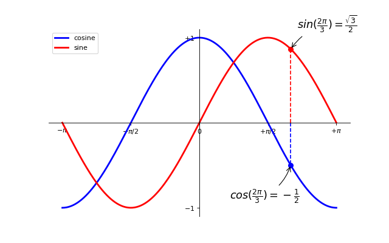

# Matplotlib
Matplotlib is a low level graph plotting library in python that serves as a visualization utility.

Matplotlib is mostly written in python, a few segments are written in C, Objective-C and Javascript for Platform compatibility.


## Importing matplotlib
```python
import matplotlib.pyplot as plt
```

## Terminology
The components are hierarchical:
* Figure object: the whole figure 
* Axes object: belongs to a Figure object and is the space where we add the data to visualize 
* Axis object: belongs to an Axes object. Axis object can be categorized as XAxis or YAxis.


The following figure also shows some of the more detailed elements composing a figure in Matplotlib:


### Figure


How to use cm in matplotlib:

```python
def cm2inch(value):
    return value/2.54

fig = plt.figure(figsize=(cm2inch(12.8), cm2inch(9.6)))
```

### Subplots


## Object-Oriented Interface
In this approach, we create Figure objects that will hold Axes objects (i.e. plots). We do this explicitly, and this in turn allows for a greater level of control and customization when constructing our figures.
```python
import matplotlib.pyplot as plt

# Initialize a Figure object
fig = plt.figure()

# Add an Axes object to the Figure using add_subplot(1,1,1)
ax = fig.add_subplot(1,1,1) # row number, col number and plot number

x = [1,2,3]
y = [1,2,3]

# Plot the data and show it
ax.plot(x, y)
plt.show()
```
Instead of generating the Figure and Axes object separately, we can initialize them together:
```python
fig, ax = plt.subplots()
ax.plot(x, y)
plt.show()
```

## Cosine and Sin examples 

```python
import numpy as np
import matplotlib.pyplot as plt

# Creating a new figure, 8x6 inches, 80 Dots Per Inch
plt.figure(figsize=(8, 6), dpi=80)

# Create new suplot, in 1x1 grid
plt.subplot(1, 1, 1)

X = np.linspace(-np.pi, np.pi, 256)
C, S = np.cos(X), np.sin(X)

# Plotting cosine with a continuous blue line with 1 pixel width
plt.plot(X, C, color="blue", linewidth=1.0, linestyle="-")

# Plotting sine with a continuous green line with 1 pixel width
plt.plot(X, S, color="green", linewidth=1.0, linestyle="-")

# Range X axis
plt.xlim(-4.0, 4.0)

# Adding ticks in X axis
plt.xticks(np.linspace(-4, 4, 9))

# Range Y axis
plt.ylim(-1.0, 1.0)

# Adding ticks in Y axis (marks)
plt.yticks(np.linspace(-1, 1, 5))

# Some changes 
plt.figure(figsize=(10, 6), dpi=80) # larger figure size
plt.plot(X, C, color="blue", linewidth=2.5, linestyle="-") # changing color and line width
plt.plot(X, S, color="red",  linewidth=2.5, linestyle="-")

# Axis limit
plt.xlim(X.min() * 1.1, X.max() * 1.1)
plt.ylim(C.min() * 1.1, C.max() * 1.1)

# Changing tick values (from 1, 2, 3, ... to π/2 , π, 2π, ...)
plt.xticks([-np.pi, -np.pi/2, 0, np.pi/2, np.pi]) # BUT here instead of π it says 3.142
plt.yticks([-1, 0, +1])

# Changing tick text using LaTex (from 3.142 to π)
plt.xticks([-np.pi, -np.pi/2, 0, np.pi/2, np.pi],
          [r'$-\pi$', r'$-\pi/2$', r'$0$', r'$+\pi/2$', r'$+\pi$'])

plt.yticks([-1, 0, +1],
          [r'$-1$', r'$0$', r'$+1$'])

# Adding labels
plt.plot(X, C, color="blue", linewidth=2.5, linestyle="-", label="coseno")
plt.plot(X, S, color="red",  linewidth=2.5, linestyle="-", label="seno")
plt.legend(loc='upper left')

# Annotations
t = 2 * np.pi / 3 # value 2π/3 

plt.plot([t, t], [0, np.cos(t)], color='blue', linewidth=2.5, linestyle="--")
plt.scatter([t, ], [np.cos(t), ], 50, color='blue')
plt.annotate(r'$cos(\frac{2\pi}{3})=-\frac{1}{2}$',
             xy=(t, np.cos(t)), xycoords='data',
             xytext=(-90, -50), textcoords='offset points', fontsize=16,
             arrowprops=dict(arrowstyle="->", connectionstyle="arc3,rad=.2"))

plt.plot([t, t],[0, np.sin(t)], color='red', linewidth=2.5, linestyle="--")
plt.scatter([t, ],[np.sin(t), ], 50, color='red')
plt.annotate(r'$sin(\frac{2\pi}{3})=\frac{\sqrt{3}}{2}$',
             xy=(t, np.sin(t)), xycoords='data',
             xytext=(+10, +30), textcoords='offset points', fontsize=16,
             arrowprops=dict(arrowstyle="->", connectionstyle="arc3,rad=.2"))

# Saving png
# plt.savefig("ejercicio_2.png)", dpi=72)

# Show result
plt.show()
```


### Subplot
With the subplot() function you can draw multiple plots in one figure

##### Example 1
```python
import matplotlib.pyplot as plt
import numpy as np

#plot 1:
x = np.array([0, 1, 2, 3])
y = np.array([3, 8, 1, 10])

plt.subplot(1, 2, 1) #the figure has 1 row, 2 columns, and this plot is the first plot.
plt.plot(x,y)

#plot 2:
x = np.array([0, 1, 2, 3])
y = np.array([10, 20, 30, 40])

plt.subplot(1, 2, 2) #the figure has 1 row, 2 columns, and this plot is the second plot.
plt.plot(x,y)

plt.show()
```


##### Example 2
```python
import matplotlib.pyplot as plt

# armemos otra figura
fig = plt.figure()

# Adding subplots (axes) 
ax1 = fig.add_subplot(2,3,1) # row, col, number of axes
ax2 = fig.add_subplot(2,3,2)
ax3 = fig.add_subplot(2,3,3)
ax4 = fig.add_subplot(2,3,4)
ax5 = fig.add_subplot(2,3,5)
ax6 = fig.add_subplot(2,3,6)


# Now let's graph data  
# axes 1
x = [0.1, 0.2, 0.3, 0.4, 0.5, 0.6, 0.7, 0.8, 0.9]
y = [0.1, 0.2, 0.3, 0.4, 0.5, 0.6, 0.7, 0.8, 0.9]

ax1.plot(x,y)

# axes 2
x2 = [1, 2, 3, 4, 5, 6, 7, 8, 9]
y2 = [1, 2, 3, 4, 5, 6, 7, 8, 9]

ax2.plot(x2,y2, color="red")

# axes 3
x3 = [1, 2, 3, 4, 5, 6, 7, 8, 9]
y3 = [1, 4, 9, 16, 25, 36, 49, 64, 81]

ax3.plot(x3,y3, color="cyan")

# mas ...
x4 = [1, 2, 3, 4, 5, 6, 7, 8, 9, 10, 11, 12, 13, 14]
y4 = [1, 1, 2, 3, 5, 8, 13, 21, 34, 55, 89, 144, 233, 377]

ax4.plot(x4,y4, color="black")
plt.show()
```
Creating figure and adding subplots:


Graph data:


## Different plots
```python
import matplotlib.pyplot as plt

fig = plt.figure()

# axes 1
ax1 = fig.add_subplot(2, 3, 1)

# axes 2
ax2 = fig.add_subplot(232, frameon=False, xbound=[0.0, 100.0])  # subplot with no frame y otra escala x
### 232 is 2 rows, 3 cols, axes number 2

# axes 3
ax3 = fig.add_subplot(233, projection='polar')  # polar

# axes 4
ax4 = fig.add_subplot(234, sharex=ax1)  # shares axis X with subplot ax1

# axes 5
ax5 = fig.add_subplot(235, facecolor="red", sharex=ax2)  # red subplot, shares axis X with subplot ax2

# axes 6
ax6 = fig.add_subplot(236, xscale="log", xbound=[1.0, 1000000000.0]) # escala logaritmica

plt.show()
```


##### Bar chart
```python
import matplotlib.pyplot as plt

fig, ax = plt.subplots()

frutas = ['apples', 'pears', 'oranges', 'strawberries']
cuantas = [40, 100, 30, 55]
bar_labels = ['apples', 'pears', 'oranges', 'strawberries']
bar_colors = ['tab:pink', 'tab:green', 'tab:orange', 'tab:red']

ax.bar(frutas, cuantas, label=bar_labels, color=bar_colors) # ax.barh for horizontal bar chart 

ax.set_ylabel('Stock') # set_xlabel for horizontal chart 
ax.set_title('Fruits')
ax.legend(title='Fruits')

plt.show()
```


## Annotations
* ax.annotate(text, xy, xytext=None, xycoords='data', textcoords=None, arrowprops=None, annotation_clip=None, **kwargs)
* ax.set_ylim(bottom=None, top=None, *, emit=True, auto=False, ymin=None, ymax=None)
* ax.vlines(x, ymin, ymax, colors=None, linestyles='solid', label='', *, data=None, **kwargs)
* ax.text(x, y, s, fontdict=None, **kwargs)
* ax.axvspan(xmin, xmax, ymin=0, ymax=1, **kwargs)
* ax.axhspan(ymin, ymax, xmin=0, xmax=1, **kwargs)

```python
import matplotlib.pyplot as plt

# inicializamos un plot
fig, ax = plt.subplots(figsize=(5, 2.7))

# generating data
import numpy as np
x = np.arange(0.0, 5.0, 0.01)
y = np.cos(2 * np.pi * x)  # función coseno

# plot
ax.plot(x, y, linewidth=2)

# ANNOTATE (arrow, text)
# xy = arrow location
# xytext = text location
ax.annotate('máximo local', xy=(2, 1), xytext=(3, 1.2),
            arrowprops=dict(facecolor='black', shrink=0.05))

# SET_YLIM (limit Y axis)
ax.set_ylim(-2, 2)

# VLINES (vertical lines)
ax.vlines(1, color="red", ymin=-1.5, ymax=1.2)
ax.vlines(3, color="green", ymin=-0.5, ymax=0.5)

# TEXT
ax.text(2,-1.5, "Esta es la función coseno", color="firebrick")

# axvspan (vertical rectangle across the axes of the plot)
# The rectangle spans from xmin to xmax horizontally, and, by default, the whole y-axis vertically.
ax.axvspan(0.5, 1.5, color="green", alpha=0.1)

# The rectangle spans from ymin to ymax vertically, and, by default, the whole x-axis horizontally.
# The x-span can be set using xmin (default: 0) and xmax (default: 1) which are in axis units
ax.axhspan(-1,1, color="brown", alpha=0.1)

plt.show()
```


#### Line styles
```python
import numpy as np
import matplotlib.pyplot as plt

x, y = np.linspace(0, 100, 10), np.zeros(10)

fig, ax = plt.subplots()

linestyles = ["solid", "dotted", "dashed", "dashdot"]
colors = ["red", "green", "blue", "brown"]
linewidths = [1, 1.5, 2, 2.5]

for i in range(0,4):
  ax.plot(x, y+i, linestyle=linestyles[i], linewidth=linewidths[i], color=colors[i])
```


#### Margins
```python
import matplotlib.pyplot as plt

# inicializamos un plot
fig = plt.figure(figsize=(5, 2.7), layout="tight")

ax1 = fig.add_subplot(2,2,1)
ax2 = fig.add_subplot(2,2,2)
ax3 = fig.add_subplot(2,2,3)
ax4 = fig.add_subplot(2,2,4)

# generating data
import numpy as np
x = np.arange(0.0, 5.0, 0.01)
y = np.cos(2 * np.pi * x)  # función coseno

# plotting
ax1.plot(x, y, linewidth=2)
ax1.margins(0) # margins = 0 encaje perfecto en el recuadro
ax1.set_title("Fit")

# zoom out
ax2.plot(x, y, linewidth=2)
ax2.margins(2,2) # mucho margen en blanco
ax2.set_title('Zoom out')

# zoom in
ax3.margins(1,1) # menos margen
ax3.plot(x, y, linewidth=2)
ax3.set_title('Zoom in')

# zoom in
ax4.margins(-0.25,-0.25) # valores negativos hacen zoom
ax4.plot(x, y, linewidth=2)
ax4.set_title('Zoom in++')
```


## Pyplot Interface
The Pyplot interface will automatically generate and set the Figure / Axes objects you work with for you. This means you will continue to layer on changes to the same Figure using pyplot commands. This is different to the Object-Oriented interface where we explicitly specify which Figure or Axes object to apply our changes to.

In this case, the plt.plot(~) call is implicitly creating a Figure instance and an Axes instance in the background:
```python
x = [1,2,3]
y = [1,2,3]
plt.plot(x,y)
plt.show()
```

## Exporting

```python
# exporting in different formats
fig.savefig("plot.pdf")
fig.savefig("plot.svg")
fig.savefig("plot.png", dpi=300)
fig.savefig("plot.jpg") 

# exporting in specified folder
plot_dir = './Data'
fig.savefig(f"{plot_dir}/plot.pdf")
```


```python

```
```python

```
