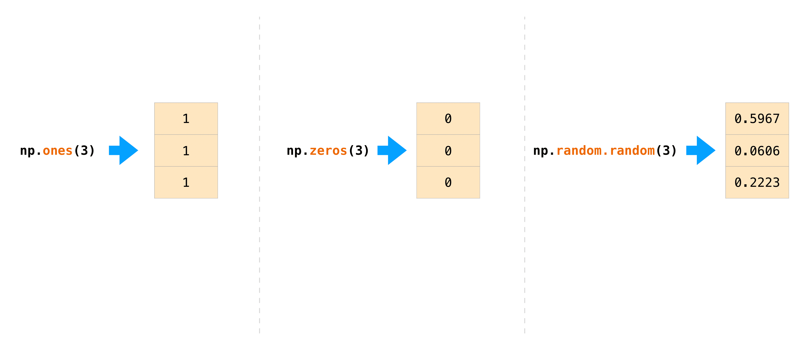
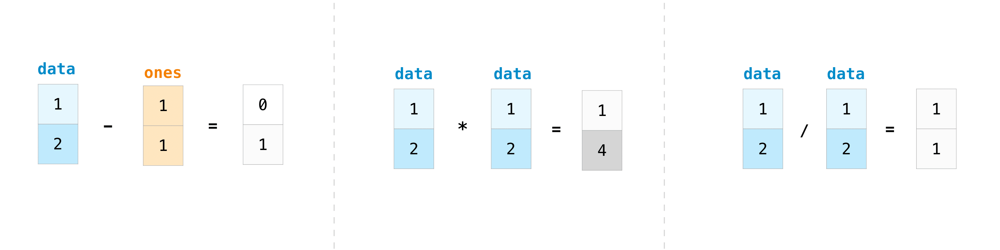

# NumPy

NumPy stands for Numerical Python and it'is a Python library used for working with arrays.

It also has functions for working in domain of linear algebra, fourier transform, and matrices.

## Importing NumPy
```python
import numpy as np
```

## NumPy Array

### Creating ndarray

The array object in NumPy is called ndarray, which can be created by using the array() function.

#### Basics
```python
a0D = np.array(42)
a1D = np.array([1, 2, 3, 4, 5])
a2D = np.array([[1, 2, 3], [4, 5, 6]])
a3D = np.array([[[1, 2, 3], [4, 5, 6]], [[1, 2, 3], [4, 5, 6]]])

print(a.ndim) #0
print(b.ndim) #1
print(c.ndim) #2
print(d.ndim) #3

type(a) #<class 'numpy.ndarray'>
```

#### Other ways

* np.zeros()
* np.ones()
* np.random()
* np.empty() --> empty, unlike zeros, does not set the array values to zero, and may therefore be marginally faster. On the other hand, it requires the user to manually set all the values in the array, and should be used with caution.
* np.arange(n) --> range of values from 0 to n
* np.arange(first, limit, increment)
* np.linspace(first, limit, number_of_elements)
* np.full(shape, fill_value)
* np.where(condition, x, y) --> to replace values that meet condition with x, and those that do not with y.



```python
e = np.zeros(2) # [0. 0.]
f = np.zeros((5,), dtype=int) # [0, 0, 0, 0, 0]
l = np.zeros((2, 1))

g = np.ones(2) # [1. 1.]

h = np.empty(2) # [ 2.51863511e-048 -2.35668071e+306]

i = np.arange(4) # [0, 1, 2, 3]
j = np.arange(2, 9, 2) # [2, 4, 6, 8]

k = np.linspace(0, 10, num=5) # [ 0. ,  2.5,  5. ,  7.5, 10. ]

l = np.full((2, 2), [1, 2]) # [[1, 2],
                            #  [1, 2]]
                            
m = np.full((3, 3), True) # [[ True  True  True]
                          # [ True  True  True]
                          # [ True  True  True]]

n = np.where(a%2!=0, -1, a) #[ 0 -1  2 -1 ] --> It replaced uneven numbers with -1
```

### Indexing

```python
a = np.array([[1, 2, 3, 4], [5, 6, 7, 8], [9, 10, 11, 12]])

a[0] # [1, 2, 3, 4]
a[2] # [9, 10, 11, 12]
a[2][3] # 12
a[2, 3] # 12

a[:, 2] # [ 3  7 11] --> all rows, column 2
a[1, :] # [5 6 7 8] --> row 1, all columns
a[:, 1:3] # [[ 2  3]  --> all rows, column from 1 to 3 (excluding the end)
          #  [ 6  7]
          #  [10 11]]

a[a < 5] # [1 2 3 4]
a[a%2==0] # [ 2  4  6  8 10 12]
a[(a > 2) & (a < 9)] # [3 4 5 6 7 8]
```

### Add, delete and order elements
* np.sort()
* np.concatenate()

```python
arr = np.array([2, 1, 5, 3, 7, 4, 6, 8])
np.sort(arr) # [1, 2, 3, 4, 5, 6, 7, 8] --> It's a copy, the original remains the same

a = np.array([[10,40,30,20],[30,20,10,40]])
print("Order array first axis (col):") 
print(np.sort(a, axis=0))

a = np.array([1, 2, 3, 4])
b = np.array([5, 6, 7, 8])
np.concatenate((a, b)) # [1, 2, 3, 4, 5, 6, 7, 8]
```
```python
b = np.array([71,63,75])

b[ [0,2] ] # [ 71 75 ]

b[ [1,0,2] ] # [63 71 75]
```

**argsort()**

```python
c = np.array([99, 33, 66, 55, 77, 22, 11, 88, 44])

c_sorted = c[ np.argsort(c) ]
print(c_sorted) # [11 22 33 44 55 66 77 88 99]
```

#### Sorting 2D

For 2D arrays we can sort from left to right (axis 1) or from top to bottom (axis 0).


* np.sort(a)
* np.sort(a, axis=0)
* np.sort(a, axis=1)

```python
import numpy as np 
a = np.array([[99, 21, 33],
               [44, 55, 66],
               [71, 8, 53]])

simple = np.sort(a)
# [[21 33 99]
#  [44 55 66]
#  [ 8 53 71]] 

b = np.sort(a, axis=0) # top to bottom 
# [[44  0 33]
#  [71 21 53]
#  [99 55 66]]

c = np.sort(a, axis=1) # left to right
# [[21 33 99]
#  [44 55 66]
#  [ 8 53 71]]
```

```python
a = np.array([[ 99, 21, 33 ],[ 44, 55, 66 ], [ 71,  0, 53 ]])
 # [[99 21 33]
 # [44 55 66]
 # [71  0 53]] 
 
# sort 1st col
a[ np.argsort(a[:,0]), : ]
 # [[44 55 66]
 # [71  0 53]
 # [99 21 33]]

# sort 2nd col
a[ np.argsort(a[:,1]), : ]
 # [[71  0 53]
 # [99 21 33]
 # [44 55 66]]

# sort by 3rd col
a[ np.argsort(a[:,2]), : ]
# [[99 21 33]
#  [71  0 53]
#  [44 55 66]]
```

### Dimension and size
```python
a = np.array([[1, 2, 3, 4], [5, 6, 7, 8], [9, 10, 11, 12]])
a.ndim # 2 
a.size # 12 --> 3 rows * 4 col = 12 (total elements)
a.shape # (3, 4) --> 3 rows, 4 col

b = a.reshape(4, 3) # [[ 1  2  3]
                    # [ 4  5  6]
                    # [ 7  8  9]
                    # [10 11 12]]

a.flatten() # [ 1  2  3  4  5  6  7  8  9 10 11 12] --> matrix to vector
```
### Operations




```python
a = np.array([[0, 1], [2, 3]])
np.transpose(a) # [[0, 2],
                # [1, 3]]

# average
a.mean() # 1.5
np.median(a) # 1.5

# min value
a.min() # 0

# max value
a.max() # 3
```

### Saving and loading variables

```python
a = np.array([1, 2, 3, 4, 5, 6])
np.save('filename', a)
b = np.load('filename.npy')

# plain text (.csv or .txt)
csv_arr = np.array([1, 2, 3, 4, 5, 6, 7, 8])
np.savetxt('new_file.csv', csv_arr)
np.loadtxt('new_file.csv')
```

