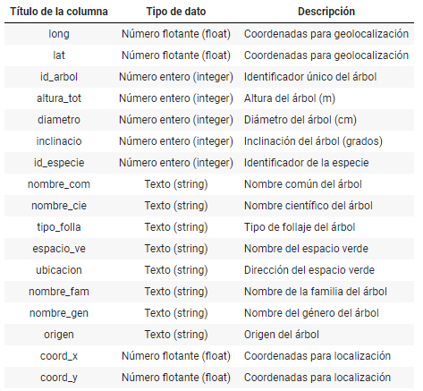
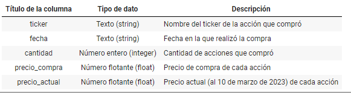
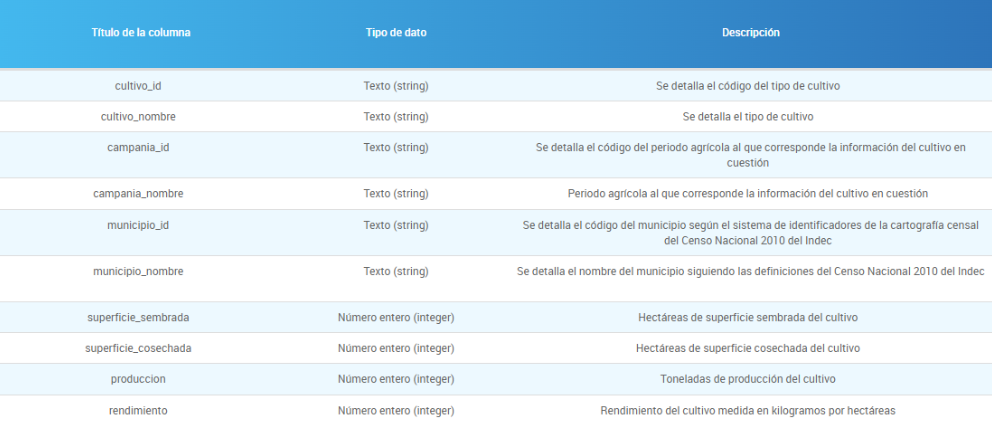

# Week 05
Temas vistos en los ejercicios de esta semana:
* File management
* csv

## Clase asincrónica
### Ejercicio 1 - incendios
#### Descripcion
1. Hacé una lista del número de incendios por causa natural entre 2000 y 2010.
2. Imprimir en pantalla para cada año el número total de incendios y el % de incendios intencionales sobre ese año.

Muestra de cómo se ve el archivo:
```csv
incendio_anio incendio_total_numero incendio_negligencia_numero incendio_intencional_numero incendio_natural_numero incendio_desconocida_numero
1993 0 0 0 0 0
1994 38 29 0 0 9
1995 11 3 0 0 8
```
#### Solucion
```python
# 1
import csv
with open('../Data/incendios-cantidad-causas-parques-nacionales_2022.csv') as f:
    filas = csv.reader(f)
    encabezados = next(filas)
    lineas = []
    for fila in filas:
        lineas.append(fila)

    causa_natural = []
    for l in lineas:
        if int(l[0])>1999 and int(l[0])<2011:
            causa_natural.append(int(l[4]))

print(causa_natural) # [4, 2, 38, 1, 12, 5, 3, 3, 6, 1, 7]

# 2
import csv
with open('../Data/incendios-cantidad-causas-parques-nacionales_2022.csv') as f:
    rows = csv.reader(f)
    headers = next(rows)
    rowList = []
    for row in rows:
        rowList.append(row)

    for l in rowList:
        año = l[0]
        total = int(l[1])
        intencionales = int(l[3])
        if total != 0:
            porcentaje_intencionales = intencionales / total * 100
            print("En el año", año, "hubo", total, "incendios, de los cuales el", round(porcentaje_intencionales, 2), "% fueron intencionales") 
            # En el año 2000 hubo 37 incendios, de los cuales el 16.22 % fueron intencionales
```

### Ejercicio 2 - Temperaturas máximas 
#### Descripcion
En la página del servicio metereológico nacional es posible descargar algunos datos históriocos. A partir de los archivos:
* **estaciones_metereologicas.csv** que contiene la información de las estaciones metereologicas en el país.
```csv
NOMBRE,PROVINCIA,LAT_GR,LAT_MIN,LONG_GR,LONG_MIN,ALTURA,NRO,NroOACI
	BASE BELGRANO II,ANTARTIDA,-77,52,-34,38,256,89034,SAYB
	BASE CARLINI (EX JUBANY),ANTARTIDA,-62,14,-58,40,11,89053,SAYJ
```
* **registro_temperatura365d_smn.csv** que tiene, para las diferentes estaciones metereologicas, los valores máximos y mínimos de temperatura registrados para diferentes días en el último año.
```csv
FECHA,TMAX,TMIN,NOMBRE
10032023,33.1,25.1,AEROPARQUE AERO
10032023,27.4,16.7,AZUL AERO
```
Determinar para la región del país en donde vive cuál fue la mínima y máxima temperatura registrada en el último año y para que día fue.

#### Solucion
```python

```
### Ejercicio 3 - Numeros
#### Descripcion
Escribir un programa que pida un número entero entre 1 y 10 y guarde en un fichero con el nombre tabla-n.txt la tabla de multiplicar de ese número, done n es el número introducido.
#### Solucion
```python
n = 0
while n<1 or n>10:
    n = int(input('Ingrese un numero del 1 al 10: '))

def tablaMultiplicar(n):
    tabla = []
    for i in range(1, 11):
        tabla.append(n*i)
    return tabla

import csv
with open('./Data/tabla-n.txt', 'w') as f:
    for num in tablaMultiplicar(n):
        f.write(str(num))
```

## Homework
### Ejercicio 1
#### Descripcion
Hacer un código que calcule la raiz cuadrada de todos los números del 1 al 100 y los guarde en un archivo "raices.csv" con el siguiente formato:
```csv
numero1, raíz de número1
numero2, raíz de número2
...
```
#### Solucion
```python
import math, csv
with open('raices.csv', 'w') as f:
    for i in range(1, 101):
        f.write(str(i) + ', ' + str(math.sqrt(i)))
        f.write('\n')
```
### Ejercicio 2
#### Descripcion
Vamos a trabajar con el archivo ['arbolado-en-espacios-verdes.csv'](../Data/arbolado-en-espacios-verdes.csv), cuya descripción está resumida en la siguiente tabla:
 <br/><br/>

Realizar: 
1. Leer el archivo y explorarlo
2. Hacer un código que cree una lista con las alturas de los arboles (columna 'altura_tot') de una determinada especie (por ejemplo, probar con 'Jacarandá' de la columna 'nombre_com' ).
3. ¿Cuál es el arbol más alto que podemos encontrar en CABA? ¿En qué espacio verde queda?
4. ¿Cuántos especios verdes diferentes podemos encontrar en CABA?
5. Crear un archivo, llamado 'palmeras.txt' que contenga todas las informaciones de los árboles de este tipo.
#### Solucion
```python
import csv
with open('./Data/arbolado-en-espacios-verdes.csv', 'r', encoding='UTF8') as f:
    filas = csv.reader(f)  # interpreta cada línea como una lista de valores
    headers = next(filas)
    lineas = []
    for fila in filas:
        lineas.append(fila)

    # 1. Alturas segun especie
    especie = input('Especie: ')
    alturas = []
    for linea in lineas:
        if(linea[7]==especie):
            h = int(linea[3])
            if (h not in alturas):
                alturas.append(h)
    print(sorted(alturas))

    # 2. Arbol más alto en CABA y en donde
    maxH = 0
    espacioVerde = ''
    arbol = ''
    for linea in lineas:
        h = int(linea[3])
        if(h > maxH):
            maxH = h
            espacioVerde = linea[10]
            arbol = linea[7]
    print(f'El arbol mas alto es {arbol} con {maxH} metros en el espacio verde {espacioVerde}')

    # 3. Cantidad espacios verdes
    cant = 0
    espacios_verdes = []
    for linea in lineas:
        if(linea[10] not in espacios_verdes):
            espacios_verdes.append(linea[10])
            cant+=1
    print(f'Hay {cant} espacios verdes')

    #4. Guardar info palmeras
    with open('palmeras.txt', 'w', encoding='UTF8') as file:
        file.writelines(headers)
        for linea in lineas:
            if(linea[9]=='Palmera'):
                file.writelines(linea)
                file.write('\n')


with open('palmeras.txt', 'r', encoding='UTF8') as file:
    filas = csv.reader(file)  # interpreta cada línea como una lista de valores
    headers = next(filas)
    lineas = []
    for fila in filas:
        lineas.append(fila)
    print(lineas[0])
    print(lineas[1])

```
### Ejercicio 3
#### Descripcion
Juan es un joven inversor que hace unos años decidió probar suerte en la bolsa argentina para cubrirse de la inflación. 
El archivo [portafolio_juan.csv](../Data/portafolio_juan.csv) contiene la información de las acciones que fue agregando a su pequeño portafolio de inversión. El mismo contiene los siguientes datos: <br/> <br/>

<br/> <br/>
1. Hacé un código que lea un csv como el mencionado anteriormente y devuelva una lista de diccionarios conteniendo los datos de cada fila, donde cada encabezado es la clave del valor correspondiente. Por ejemplo, el primer elemento de la lista debería ser {'ticker': 'LOMA', 'fecha': '2021-04-26', 'cantidad': '28', 'precio_compra': '184.3', 'precio_actual': '507'}.
Ayuda: la función zip puede facilitar la creación de los diccionarios.
2. A partir de la lista de diccionarios que creaste en el inciso anterior, calculá el valor actual del portafolio de acciones (es decir, la suma del precio actual de las acciones mutiplicado por la cantidad de acciones que posee) y el costo de compra del mismo (la suma del precio de compra de las acciones mutiplicado por la cantidad de acciones que compró ese día). ¿Juan ganó o perdió dinero?
3. El archivo cer-uva-uvi-diarios.csv, obtenido de la página de datos abiertos del Gobierno de la Nación, contiene el valor diario del Coeficiente de Estabilización de Referencia (CER), las Unidades de Valor Adquisitvo (UVA) y las Unidades de Vivienda (UVI). Creá un diccionario con los valores diarios de las UVA, donde las claves son las fechas y los valores el el valor de la UVA ese día ({fecha:valor_uva}).
Nota: el archivo comienza desde 2003, cuando no había UVAs, con lo cual van a haber varios valores vacíos. No nos van a molestar.
4. Usando el diccionario de valores de UVA del inciso anterior, calculá cuantas UVAs (supongamos que a través de plazos fijos UVA renovados continuamente) podría haber adquirido Juan gastando el mismo dinero que usó en las acciones (y en las mismas fechas). Calculá el valor total en pesos del las mismas usando el valor actúal de $208,99 (al 10 de marzo de 2023, este valor no está en el archivo de los UVAS porque se termina en el diciembre pasado!). ¿Qué opción rindió mejor por ahora?

Nota: Para responder la pregunta anterior, ignorá todos los detalles técnicos, como posibles limitaciones al hacer los plazos fijos UVA, el hecho de que algunas acciones pagan dividendos, etc. Usá sólo el valor actual del portafolio que calculaste en el inciso b

#### Solucion
```python

```
### Ejercicio 4
#### Descripcion
La página de datos abiertos de la Provincia de Buenos Aires lista varios datasets de interés en diversas áreas ver. En particular, uno de estos datasets contiene datos históricos con detalles de los cultivos en la provincia por campaña y municipio (ver [Estimaciones agrícolas](../Data/estimaciones-agricolas-PBA-1969-2022.csv)). El mismo contiene los siguientes datos: <br/> <br/>
 <br/> <br/>
1. Escribí código que te permita leer este archivo y explorarlo
2. Escribí código que te permita leer todos los datos (filas) de la planilla, almacenando los valores (columnas) en alguna estructura de datos de Python (dict, lista, tupla, set) que te parezca la más apropiada para responder las consultas que vienen a continuación. Explicá y fundamentá tu elección.
Si no encontrás ninguna que sea perfecta o que no se ajuste en forma ideal a lo que necesitás, discutilo y sugerí que cambios harias (en los datos) para poder operar más facilmente con la estructura de Python que elegiste.
<br/> <br/> Consultas:
* Cuántos tipos de cultivos diferentes hay registrados en la Provincia de Buenos Aires?
* Cuál es el principal municipio productor de Ajo en la Provincia? y cuál fue el año de mayor superficie sembrada? Y el año de mayor rendimiento?
* Repetí el punto ii para todos los cultivos. Cuáles son los mejores años en la Provincia? Coinciden para todos los cultivos?
#### Solucion
[Abrir solución](../Semanas/Week%2005/3_acciones_uva.py)

### Ejercicio 
#### Descripcion
La página de datos abiertos de la Provincia de Buenos Aires lista varios datasets de interés en diversas áreas.
En particular, uno de estos datasets contiene datos históricos con detalles de los cultivos en la provincia por campaña y municipio (ver [Estimaciones agrícolas](../Data/estimaciones-agricolas-PBA-1969-2022.csv)). 
<br> a. <t> Escribí código que te permita leer este archivo y explorarlo
<br> b. <t> Escribí código que te permita leer todos los datos (filas) de la planilla, almacenando los valores (columnas) en alguna estructura de datos de Python (dict, lista, tupla, set) que te parezca la más apropiada para responder las consultas que vienen a continuación. Explicá y fundamentá tu elección.  
Si no encontrás ninguna que sea perfecta o que no se ajuste en forma ideal a lo que necesitás, discutilo y sugerí que cambios harias (en los datos) para poder operar más facilmente con la estructura de Python que elegiste.
<br>Consultas:
<br> i. <t> Cuántos tipos de cultivos diferentes hay registrados en la Provincia de Buenos Aires?
<br> ii. <t>  Cuál es el principal municipio productor de Ajo en la Provincia? y cuál fue el año de mayor superficie sembrada? Y el año de mayor rendimiento?
<br> iii. <t>  Repetí el punto ii para todos los cultivos. Cuáles son los mejores años en la Provincia? Coinciden para todos los cultivos?

#### Solucion
[Solución 1](./Week%2005/4_cultivos.py)
[Solución 2](./Weeks/Week%2005/4_cultivos_forma2.py)
### Ejercicio 
#### Descripcion

#### Solucion
```python

```