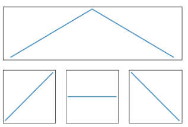

# Week 09
Temas vistos en los ejercicios de esta semana:
* Plot
* 

## Homework
### Ejercicio 1 - Arbolado
#### Descripcion
Vamos utilizar el archivo 'arbolado-en-espacios-verdes.csv' 
1. Realizar un gráfico de puntos que relacione las alturas con los diámetros para las especies (nombre_com) 'Ombú', 'Ceibo' y 'Acacia'. ¿Mantienen todos ellos la misma relación?
2. Para las 10 especies de origen exótico con mayor número de ejemplares estudiar las distribuciones de altura, discriminando por especie en diferentes subplots.
3. Modificar el programa para que guarde el grafico realizado en el punto 1 en un archivo PDF y el del punto 2 en un archivo JPG.

#### What's in here
* 

[Solución](./Weeks/Week09/1_arbolado.py)

### Ejercicio 2 - Graficos
#### Descripcion
Modificá el siguiente código para reproducir el gráfico que se muestra. Prestá atención a cómo se numeran los subplots.



```python
import matplotlib.pyplot as plt

fig = plt.figure()
plt.subplot(2, 1, 1) # define la figura de arriba
plt.plot([0,1,2],[0,1,0]) # dibuja la curva 
plt.xticks([]), plt.yticks([]) # saca las marcas

plt.subplot(2, 2, 3) # define la primera de abajo, que sería la tercera si fuera una grilla regular de 2x2
plt.plot([0,1],[0,1])
plt.xticks([]), plt.yticks([])

plt.subplot(2, 2, 4) # define la segunda de abajo, que sería la cuarta figura si fuera una grilla regular de 2x2
plt.plot([0,1],[1,0])
plt.xticks([]), plt.yticks([])

plt.show()
```
#### What's in here
* 

[Solución](./Weeks/Week09/2_graficos.py)

### Ejercicio 3 - Distancias
Teniendo en cuenta las distancias de los planetas al Sol - que son en unidades relativas, la distancia Tierra-Sol es 1 (unidades astronómicas), los periodos de sus órbitas (cuanto tardan en dar la vuelta al Sol, en años) y los nombres de los planetas:

* Plotear los períodos vs las distancias de los planetas como puntos y en una escala doble logarítmica (log X, log Y)
* Escribir el nombre del planeta cerca del punto correspondiente a ese planeta en el plot (puntos adicionales si el texto no se superpone y se lee claro, más puntos adicionales si usan flechas)
* Trazar dos líneas punteadas (una vertical, una horizontal) que se crucen en el punto de la Tierra en el gráfico.

```python
distancias = [0.39, 0.72, 1.00, 1.52, 5.20, 9.54, 19.22, 30.06, 39.48]

periodos = [0.24, 0.62, 1.00, 1.88, 11.86, 29.46, 84.01, 164.8, 248.09]

planetas = ["Mercurio", "Venus", "Tierra", "Marte", "Jupiter", "Saturno", 
            "Urano", "Neptuno", "Plutón"]
```


#### What's in here
* 
[Solución](./Weeks/Week09/3_distancias.py)

### Ejercicio 4 - Clima
#### Descripcion
Bajar los datos de temperaturas globales promedio del aire, de este sitio: https://raw.githubusercontent.com/sbu-python-summer/python-tutorial/master/day-4/nasa-giss.txt

(los datos son de la NASA: https://data.giss.nasa.gov/gistemp/graphs/)

Hay 3 columnas con datos: el año, el cambio de temperatura (No-smoothing = no suavizado), y una representación suavizada del cambio de temperatura (Lowess).

Consigna:

Leer estos datos usando Pandas – ojo que no son csv, ni tsv, son de ancho fijo! Tip: ver pd.read_fwf()
Plotear la representación suavizada del cambio de temperatura como una línea
Plotear los datos de cambio de temperatura como puntos
Colorear los puntos en azul si son negativos (< 0) y rojos si son positivos (>=0).

#### What's in here
* 

[Solución](./Weeks/Week09/4_clima.py)

